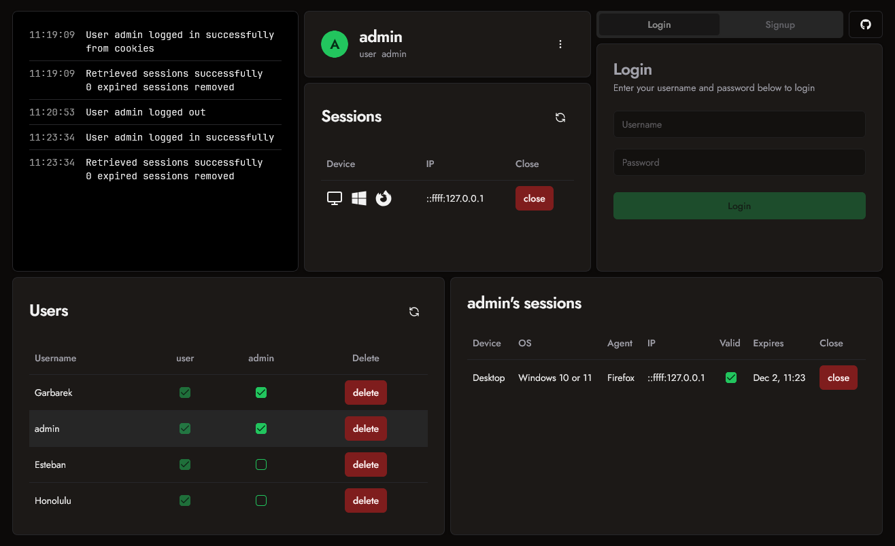

# MERN Auth

Basic custom username/password auth system.

Live demo: https://mern-auth-o1gw.onrender.com

- Session based
- Role authorization (user, admin)
- Authenticated users can log in and see their own open sessions.
- Admins can delete users, invalidate sessions and close other user's sessions.

[](https://mern-auth-o1gw.onrender.com)

## Back End

- Node.js + Express
- Refresh and Access Tokens (JWT)
- Hashed passwords (bcrypt)
- HttpOnly Cookies (cookie-parser)
- MongoDB & Mongoose
- Custom middleware
- Protected endpoints
- Auto delete expired sessions from database

## Front End

- Vite + React + TypeScript
- Shadcn/ui
- Tailwind CSS
- Icons: [Lucide](https://lucide.dev/) + [react-icons](https://react-icons.github.io/react-icons/)
- Fonts: [Jost](https://indestructibletype.com/Jost.html) + [JetBrainsMono](https://www.jetbrains.com/lp/mono/)

## Usage

- Create a MongoDB database and copy your URI
- Create new `.env` files following the `.env.example` files in both `client` and `server` folders

### Install server dependencies and run:

```bash
cd server
npm install
npm run dev
```

### Install client dependencies and run:

```bash
cd client
npm install
npm run dev
```

## License

Licensed under the MIT License. Check the [LICENSE](./LICENSE.md) file for details.
